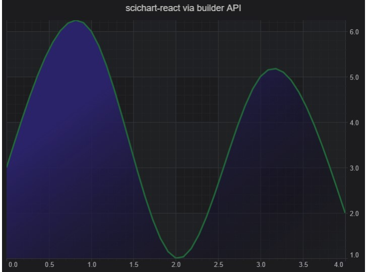
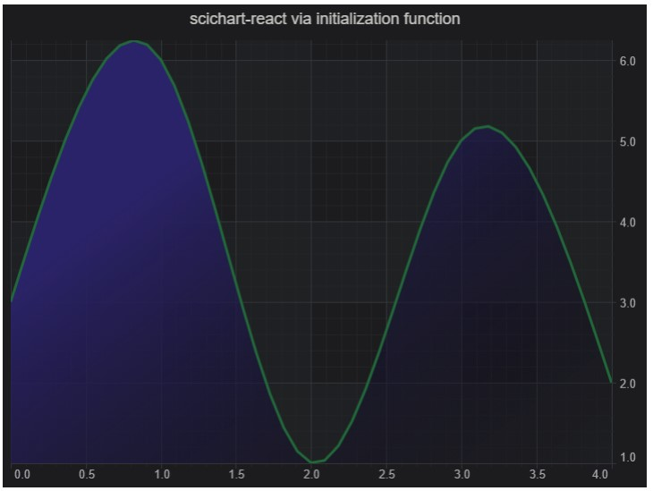
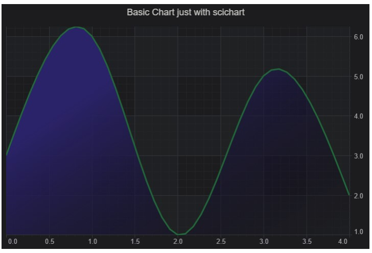

# blog-scichart-react

## Setting up a new React project with SciChart

A recommended way of setting up a new project is to use React, Webpack, and TypeScript.

**package.json**
```
{
    "name": "blog-scichart-react",
    "version": "1.0.0",
    "description": "scichart-react vs scichart",
    "main": "src/index.tsx",
    "scripts": {
        "build": "webpack --mode production",
        "start": "ts-node server",
        "dev": "webpack-dev-server --mode development"
    },
    "keywords": [],
    "author": "",
    "license": "ISC",
    "dependencies": {
        "react": "^18.3.1",
        "react-dom": "^18.3.1",
        "scichart": "^3.5.711",
        "scichart-react": "^0.1.9",
        "ts-node": "^10.9.2"
    },
    "devDependencies": {
        "@types/react": "^18.3.18",
        "@types/react-dom": "^18.3.5",
        "copy-webpack-plugin": "^12.0.2",
        "prettier": "^3.4.2",
        "ts-loader": "^9.5.1",
        "typescript": "^5.1.6",
        "webpack": "^5.97.1",
        "webpack-cli": "^5.1.4",
        "webpack-dev-server": "^5.2.0"
    }
}
```

**webpack.config.js**

```
const path = require("path");
const CopyPlugin = require("copy-webpack-plugin");

module.exports = {
  entry: "./src/index.tsx",
  performance: {
    hints: false
  },
  module: {
    rules: [
      {
        test: /\.tsx?$/,
        use: "ts-loader",
        exclude: /node_modules/
      },
    ]
  },
  resolve: {
    extensions: [".js", ".ts", ".tsx"]
  },
  output: {
    filename: "bundle.js",
    path: path.resolve(__dirname, "build")
  },
  plugins: [
    new CopyPlugin({
      patterns: [
        { from: "src/index.html", to: "" },
        { from: "node_modules/scichart/_wasm/scichart2d.data", to: "" },
        { from: "node_modules/scichart/_wasm/scichart2d.wasm", to: "" },
        { from: "node_modules/scichart/_wasm/scichart3d.data", to: "" },
        { from: "node_modules/scichart/_wasm/scichart3d.wasm", to: "" },
      ]
    })
  ]
};
```

**tsconfig.json**

```
{
    "compilerOptions": {
        "outDir": "./build",
        "sourceMap": true,
        "strict": true,
        "noImplicitAny": true,
        "strictNullChecks": false,
        "strictFunctionTypes": true,
        "strictBindCallApply": true,
        "strictPropertyInitialization": false,
        "noImplicitThis": true,
        "alwaysStrict": true,
        "noUnusedLocals": false,
        "noUnusedParameters": false,
        "noImplicitReturns": true,
        "noFallthroughCasesInSwitch": true,
        "module": "commonjs",
        "target": "es6",
        "jsx": "react-jsx",
        "allowJs": true,
        "typeRoots": [
            "./src/types", "./node_modules/@types"],
        "esModuleInterop": false,
        "skipLibCheck": false,
        "forceConsistentCasingInFileNames": true
    },
    "include": [
        "src/**/*"
    ],
    "exclude": [
        "node_modules"
    ]
}
```

**index.html**
```
<html lang="en-us">
    <head>
        <meta charset="utf-8" />
        <meta content="text/html; charset=utf-8" http-equiv="Content-Type" />
        <title>SciChart demo</title>
        <script async type="text/javascript" src="bundle.js"></script>
    </head>
    <body></body>
</html>
```

**index.tsx**
```
import { createRoot } from 'react-dom/client';
import App from './App';

// Clear the existing HTML content
document.body.innerHTML = '<div id="app"></div>';

const root = createRoot(document.getElementById('app'));
root.render(<App />);
```

Another option would be loading scichart.js library from CDN `https://www.scichart.com/documentation/js/current/webframe.html#Tutorial01IncludingSciChartjsHTMLPage.html`.

## Create scichart-react Chart with Config (Builder) API

The builder API is handy for sharing charts because JSON configuration is self-sufficient.



```typescript
import {
    ESeriesType,
    EThemeProviderType
} from 'scichart';
import { SciChartReact } from 'scichart-react';

// 1. Via builder API
const chartConfig = {
    surface: {
        theme: { type: EThemeProviderType.Dark },
        title: 'scichart-react via builder API',
        titleStyle: {
            fontSize: 20,
        },
    },
    series: {
        type: ESeriesType.SplineMountainSeries,
        options: {
            strokeThickness: 4,
            stroke: '#216939',
            fillLinearGradient: {
                startPoint: { x: 0, y: 0 },
                endPoint: { x: 1, y: 1 },
                gradientStops: [
                    { offset: 0.3, color: '#2d2169' },
                    { offset: 1, color: 'transparent' },
                ],
            },
        },
        xyData: { xValues: [0, 1, 2, 3, 4], yValues: [3, 6, 1, 5, 2] },
    },
};

export default function SciChartReactDemo() {
    // @ts-ignore
    return <SciChartReact style={{ width: 800, height: 600 }} config={chartConfig} />;
}
```

## Create scichart-react Chart with Programmatic API

Another alternative is to use the Programmatic API. It is the primary scichart.js API with slightly better typescript support and a complete set of features.



```typescript
import {
    EThemeProviderType,
    NumericAxis,
    SciChartSurface,
    SplineMountainRenderableSeries,
    XyDataSeries,
} from 'scichart';
import { SciChartReact } from 'scichart-react';

// 2. Via Initialization function
const chartInitializationFunction = async (rootElement: string | HTMLDivElement) => {
    const { sciChartSurface, wasmContext } = await SciChartSurface.create(rootElement, {
        theme: { type: EThemeProviderType.Dark },
        title: 'scichart-react via initialization function',
        titleStyle: {
            fontSize: 20,
        },
    });

    sciChartSurface.xAxes.add(new NumericAxis(wasmContext));
    sciChartSurface.yAxes.add(new NumericAxis(wasmContext));
    sciChartSurface.renderableSeries.add(
        new SplineMountainRenderableSeries(wasmContext, {
            dataSeries: new XyDataSeries(wasmContext, {
                xValues: [0, 1, 2, 3, 4],
                yValues: [3, 6, 1, 5, 2],
            }),
            strokeThickness: 4,
            stroke: '#216939',
            fillLinearGradient: {
                startPoint: { x: 0, y: 0 },
                endPoint: { x: 1, y: 1 },
                gradientStops: [
                    { offset: 0.3, color: '#2d2169' },
                    { offset: 1, color: 'transparent' },
                ],
            },
        }),
    );

    return { sciChartSurface };
};

export default function SciChartReactDemo() {
    return <SciChartReact style={{ width: 800, height: 600 }} initChart={chartInitializationFunction} />;
}

```

## Create scichart Chart (without scichart-react)

The third option would be to create the chart without scichart-react wrapper using only scichart.js. As you can see, the code is not very different from the previous example.



```typescript
import { useEffect, useRef } from 'react';
import {
    NumericAxis,
    SciChartJSDarkTheme,
    SciChartSurface,
    SplineMountainRenderableSeries,
    XyDataSeries,
} from 'scichart';

async function createChart(divElementId: string | HTMLDivElement) {
    const { sciChartSurface, wasmContext } = await SciChartSurface.create(divElementId, {
        theme: new SciChartJSDarkTheme(),
        title: 'Basic Chart just with scichart',
        titleStyle: {
            fontSize: 20,
        },
    });

    const xAxis = new NumericAxis(wasmContext);
    const yAxis = new NumericAxis(wasmContext);

    sciChartSurface.xAxes.add(xAxis);
    sciChartSurface.yAxes.add(yAxis);

    const xyDataSeries = new XyDataSeries(wasmContext, { xValues: [0, 1, 2, 3, 4], yValues: [3, 6, 1, 5, 2] });
    const splineMountainSeries = new SplineMountainRenderableSeries(wasmContext, {
        strokeThickness: 4,
        stroke: '#216939',
        fillLinearGradient: {
            startPoint: { x: 0, y: 0 },
            endPoint: { x: 1, y: 1 },
            gradientStops: [
                { offset: 0.3, color: '#2d2169' },
                { offset: 1, color: 'transparent' },
            ],
        },
        dataSeries: xyDataSeries,
    });
    sciChartSurface.renderableSeries.add(splineMountainSeries);

    return { sciChartSurface };
}

export default function SciChartPureDemo() {
    const chartId = 'chartId';
    const chartRef = useRef<SciChartSurface>();

    useEffect(() => {
        createChart(chartId).then((res) => (chartRef.current = res.sciChartSurface));
        return () => chartRef.current?.delete();
    }, []);

    return <div id={chartId} style={{ width: 800 }} />;
}

```

## Conclusion

Creating React charts is easy with scichart.js, and there are several options for doing it. Creating a chart using the scichart-react npm module is the easiest; any developer with React experience can use it immediately. The Builder API allows for easy sharing of charts between developers. The programmatic approach leverages the power of the primary API, and if you need even more control, you can use scichart.js in React directly without the scichart-react wrapper.