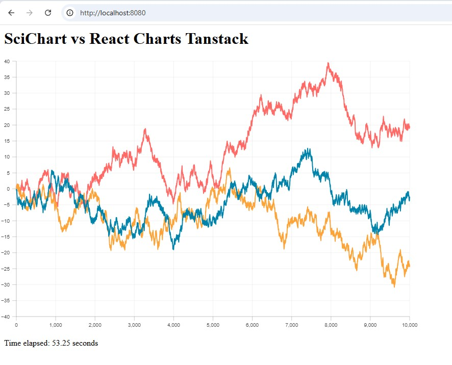
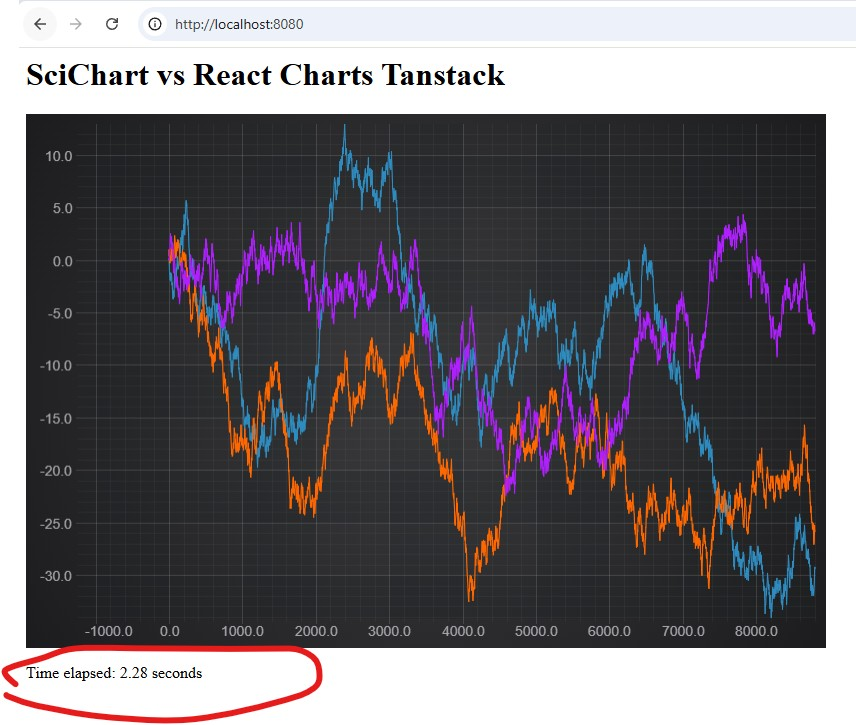

# Creating Realtime JavaScript Chart with SciChart.js and React Charts Tanstack

In this blogpost we are creating a simple realtime performance demo using two charting libraries SciChart.js and React Charts Tanstack.

## Setting up a new React project

First we set up a new project. A recommended way of setting up a new project is to use React, Webpack, and TypeScript.

**package.json**
```JSON
{
    "name": "scichart-reactcharts",
    "version": "1.0.0",
    "description": "scichart vs react charts tanstack",
    "main": "src/index.tsx",
    "scripts": {
        "build": "webpack --mode production",
        "start": "ts-node server",
        "dev": "webpack-dev-server --mode development"
    },
    "keywords": [],
    "author": "",
    "license": "ISC",
    "dependencies": {
        "react": "^19.0.0",
        "react-charts": "^3.0.0-beta.57",
        "react-dom": "^19.0.0",
        "scichart": "^3.5.742",
        "ts-node": "^10.9.2"
    },
    "devDependencies": {
        "@types/react": "^19.0.10",
        "@types/react-dom": "^19.0.4",
        "copy-webpack-plugin": "^13.0.0",
        "prettier": "^3.5.3",
        "ts-loader": "^9.5.2",
        "typescript": "^5.8.2",
        "webpack": "^5.98.0",
        "webpack-cli": "^6.0.1",
        "webpack-dev-server": "^5.2.0"
    }
}
```

**webpack.config.js**

```js
const path = require("path");
const CopyPlugin = require("copy-webpack-plugin");

module.exports = {
  entry: "./src/index.tsx",
  performance: {
    hints: false
  },
  module: {
    rules: [
      {
        test: /\.tsx?$/,
        use: "ts-loader",
        exclude: /node_modules/
      },
    ]
  },
  resolve: {
    extensions: [".js", ".ts", ".tsx"]
  },
  output: {
    filename: "bundle.js",
    path: path.resolve(__dirname, "build")
  },
  plugins: [
    new CopyPlugin({
      patterns: [
        { from: "src/index.html", to: "" },
        { from: "node_modules/scichart/_wasm/scichart2d.data", to: "" },
        { from: "node_modules/scichart/_wasm/scichart2d.wasm", to: "" },
        { from: "node_modules/scichart/_wasm/scichart3d.data", to: "" },
        { from: "node_modules/scichart/_wasm/scichart3d.wasm", to: "" },
      ]
    })
  ]
};
```

**tsconfig.json**

```json
{
    "compilerOptions": {
        "outDir": "./build",
        "sourceMap": true,
        "strict": true,
        "noImplicitAny": true,
        "strictNullChecks": false,
        "strictFunctionTypes": true,
        "strictBindCallApply": true,
        "strictPropertyInitialization": false,
        "noImplicitThis": true,
        "alwaysStrict": true,
        "noUnusedLocals": false,
        "noUnusedParameters": false,
        "noImplicitReturns": true,
        "noFallthroughCasesInSwitch": true,
        "module": "commonjs",
        "target": "es6",
        "jsx": "react-jsx",
        "allowJs": true,
        "typeRoots": [
            "./src/types", "./node_modules/@types"],
        "esModuleInterop": true,
        "skipLibCheck": false,
        "forceConsistentCasingInFileNames": true
    },
    "include": [
        "src/**/*"
    ],
    "exclude": [
        "node_modules"
    ]
}
```

**index.html**
```html
<html lang="en-us">
    <head>
        <meta charset="utf-8" />
        <meta content="text/html; charset=utf-8" http-equiv="Content-Type" />
        <title>SciChart and React Charts Tanstack</title>
        <script async type="text/javascript" src="bundle.js"></script>
    </head>
    <body></body>
</html>
```

**index.tsx**
```typescript
import { createRoot } from 'react-dom/client';
import App from './App';

// Clear the existing HTML content
document.body.innerHTML = '<div id="app"></div>';

const root = createRoot(document.getElementById('app'));
root.render(<App />);
```

## Create realtime demo with React Charts Tanstack

Let's create an demo which draws three random walk line charts in real time.
For random walk generation we will use this class

```typescript
export class RandomWalkGenerator {
    private readonly bias: number;
    private last: number;
    private i: number;
    private _seed: number;
    constructor(bias: number = 0.01) {
        this.bias = bias;
        this.reset();
    }

    public Seed(seed: number) {
        this._seed = seed % 2147483647;
        if (this._seed <= 0) this._seed += 2147483646;
        return this;
    }

    public reset() {
        this.i = 0;
        this.last = 0;
    }

    public getRandomWalkSeries(count: number): { xValues: number[]; yValues: number[] } {
        const xValues: number[] = [];
        const yValues: number[] = [];
        const random = () => (this._seed === undefined ? Math.random() : (this.nextSeeded() - 1) / 2147483646);
        for (let i = 0; i < count; i++) {
            const next: number = this.last + (random() - 0.5 + this.bias);
            xValues.push(this.i++);
            yValues.push(next);
            this.last = next;
        }

        return { xValues, yValues };
    }

    private nextSeeded() {
        return (this._seed = (this._seed * 16807) % 2147483647);
    }
}
```

We will append 100 data points to each data series every 20 milliseconds. Which makes chart to render at 50 frames per seconds (FPS).
We will be attaching the data points until we get 10,000.
In addition we will measure the time it takes to render all 10,000 data points.

This is the ReactChartDemo component we will use to render the realtime demo with React Charts Tanstack JavaScript library. The React Charts Tanstack API is very intuitive and supports TypeScript, which makes it easy to create the demo.

```tsx
import { useMemo, useState, useEffect, useRef } from 'react';
import { AxisOptions, Chart } from 'react-charts';
import { RandomWalkGenerator } from '../RandomWalkGenerator';

type TDataPoint = {
    x: number;
    y: number;
};

type TSeries = {
    label: string;
    data: TDataPoint[];
};

const initialDataSeries: TSeries[] = [
    {
        label: 'Series 1',
        data: [],
    },
    {
        label: 'Series 2',
        data: [],
    },
    {
        label: 'Series 3',
        data: [],
    },
];

const numberOfPointsPerTimerTick = 100; // 100 points are appended every timer tick
const timerInterval = 20; // the timer ticks every 20 milliseconds (equivalent to 50 FPS)
const maxPoints = 10000; // max points for a single series before the demo stops

let perfStart: number;
let perfEnd: number;

export default function ReactChartsDemo() {
    const timerIdRef = useRef<NodeJS.Timeout>(null);
    const [dataSeries, setDataSeries] = useState(initialDataSeries);
    const [timeElapsed, setTimeElapsed] = useState('');

    const primaryAxis = useMemo(
        (): AxisOptions<TDataPoint> => ({
            getValue: (datum) => datum.x,
            scaleType: 'linear',
        }),
        [],
    );

    const secondaryAxes = useMemo(
        (): AxisOptions<TDataPoint>[] => [
            {
                getValue: (datum) => datum.y,
                scaleType: 'linear',
            },
        ],
        [],
    );

    useEffect(() => {
        const randomWalkGenerators = [1, 2, 3].map((_) => {
            return new RandomWalkGenerator(0);
        });
        const stopUpdate = () => {
            clearTimeout(timerIdRef.current);
            timerIdRef.current = undefined;
            randomWalkGenerators.forEach((rw) => rw.reset());
        };
        const updateFunc = () => {
            if (initialDataSeries[0].data.length >= maxPoints) {
                perfEnd = performance.now();
                setTimeElapsed(`${((perfEnd - perfStart)/1000).toFixed(2)} seconds`);

                stopUpdate();
                return;
            }

            randomWalkGenerators.forEach((randomWalk, index) => {
                // Get the next N random walk x,y values
                const { xValues, yValues } = randomWalk.getRandomWalkSeries(numberOfPointsPerTimerTick);
                for (let i = 0; i < numberOfPointsPerTimerTick; i++) {
                    const x = xValues[i];
                    const y = yValues[i];
                    initialDataSeries[index].data.push({ x, y });
                }
            });
            setDataSeries([...dataSeries]);
            timerIdRef.current = setTimeout(updateFunc, timerInterval);
        };
        const startUpdate = () => {
            if (timerIdRef.current) {
                stopUpdate();
            }
            perfStart = performance.now();
            timerIdRef.current = setTimeout(updateFunc, timerInterval);
        };
        startUpdate();
    }, []);

    return (
        <div>
            <div style={{ width: 800, height: 533 }}>
                <Chart
                    options={{
                        data: dataSeries,
                        primaryAxis,
                        secondaryAxes,
                        initialWidth: 800,
                        initialHeight: 533.33,
                    }}
                />
            </div>
            <p>Time elapsed: {timeElapsed}</p>
        </div>
    );
}

```

As a result we get this chart which works fine for the first 1000 point. However, after 1000 points it gets slow and in overall it takes 53 seconds to render the whole data set of 10,000 points. Where the expected time when rendering at 50FPS and appending 100 point at a time is 2 seconds.




## Create the realtime demo with SciChart.js

Now we will create the same chart using SciChart.js data visualization library with hardware acceleration. We will use the same random walk generator class.

We will create two files `createChart.ts` with the code related to charting and `index.ts` with the React code.

```typescript
import {
    EAutoRange,
    EAxisAlignment,
    EColor,
    EDragMode,
    FastLineRenderableSeries,
    MouseWheelZoomModifier,
    NumericAxis,
    RubberBandXyZoomModifier,
    SciChartSurface,
    XAxisDragModifier,
    XyDataSeries,
    YAxisDragModifier,
    ZoomExtentsModifier,
} from 'scichart';
import { RandomWalkGenerator } from '../RandomWalkGenerator';

const numberOfPointsPerTimerTick = 100; // 100 points are appended every timer tick
const timerInterval = 20; // the timer ticks every 20 milliseconds (equivalent to 50 FPS)
const maxPoints = 10000; // max points for a single series before the demo stops

let perfStart: number;
let perfEnd: number;

export const createChart = async (rootElement: string | HTMLDivElement) => {
    const { wasmContext, sciChartSurface } = await SciChartSurface.createSingle(rootElement);

    // Create an XAxis and YAxis with autoRange=Always
    const xAxis = new NumericAxis(wasmContext, { autoRange: EAutoRange.Always });
    sciChartSurface.xAxes.add(xAxis);
    const yAxis = new NumericAxis(wasmContext, { autoRange: EAutoRange.Always, axisAlignment: EAxisAlignment.Left });
    sciChartSurface.yAxes.add(yAxis);

    // Create some DataSeries
    const dataSeries: XyDataSeries[] = [
        new XyDataSeries(wasmContext, { containsNaN: false, isSorted: true }),
        new XyDataSeries(wasmContext, { containsNaN: false, isSorted: true }),
        new XyDataSeries(wasmContext, { containsNaN: false, isSorted: true }),
    ];

    const seriesColors = [EColor.Blue, EColor.Orange, EColor.Purple];

    // Create some FastLineRenderableSeries bound to each dataSeries and add to the chart
    dataSeries.map((ds, index) => {
        sciChartSurface.renderableSeries.add(
            new FastLineRenderableSeries(wasmContext, {
                dataSeries: ds,
                strokeThickness: 2,
                stroke: seriesColors[index],
            }),
        );
    });

    // Add some interactivity modifiers. These are only operational when the demo is paused
    // as interactivity conflicts with AutoRange.Always
    sciChartSurface.chartModifiers.add(
        new RubberBandXyZoomModifier(),
        new MouseWheelZoomModifier(),
        new XAxisDragModifier({ dragMode: EDragMode.Panning }),
        new YAxisDragModifier({ dragMode: EDragMode.Panning }),
        new ZoomExtentsModifier(),
    );

    // This class generates some data for our example
    // It generates a random walk, which is a line which increases or decreases by a random value
    // each data-point
    const randomWalkGenerators = [1, 2, 3].map((_) => {
        return new RandomWalkGenerator(0);
    });

    let timerId: NodeJS.Timeout;

    // Function called when the user clicks stopUpdate button
    const stopUpdate = () => {
        clearTimeout(timerId);
        timerId = undefined;
        randomWalkGenerators.forEach((rw) => rw.reset());
        // Disable autoranging on X when the demo is paused. This allows zooming and panning
        xAxis.autoRange = EAutoRange.Once;
    };

    const updateFunc = (setTimeElapsedFn: (v: string) => void) => {
        if (dataSeries[0].count() >= maxPoints) {
            perfEnd = performance.now();
            setTimeElapsedFn(`${((perfEnd - perfStart) / 1000).toFixed(2)} seconds`);
            stopUpdate();
            return;
        }

        randomWalkGenerators.forEach((randomWalk, index) => {
            // Get the next N random walk x,y values
            const { xValues, yValues } = randomWalk.getRandomWalkSeries(numberOfPointsPerTimerTick);

            // Append these to the dataSeries. This will cause the chart to redraw
            dataSeries[index].appendRange(xValues, yValues);
        });

        timerId = setTimeout(() => updateFunc(setTimeElapsedFn), timerInterval);
    };

    // Function called when the user clicks startUpdate button
    const startUpdate = (setTimeElapsedFn: (v: string) => void) => {
        if (timerId) {
            stopUpdate();
        }

        // Enable autoranging on X when running the demo
        xAxis.autoRange = EAutoRange.Always;
        dataSeries.forEach((ds) => ds.clear());
        perfStart = performance.now();
        timerId = setTimeout(() => updateFunc(setTimeElapsedFn), timerInterval);
    };

    let lastRendered = Date.now();
    sciChartSurface.rendered.subscribe(() => {
        const currentTime = Date.now();
        const timeDiffSeconds = new Date(currentTime - lastRendered).getTime() / 1000;
        lastRendered = currentTime;
        const fps = 1 / timeDiffSeconds;
        const renderStats = {
            numberPoints:
                sciChartSurface.renderableSeries.size() * sciChartSurface.renderableSeries.get(0).dataSeries.count(),
            fps,
        };
    });

    return { wasmContext, sciChartSurface, controls: { startUpdate, stopUpdate } };
};
```

```tsx
import { useEffect, useState, useRef } from 'react';
import { SciChartSurface } from 'scichart';
import { createChart } from './createChart';

export default function SciChartDemo() {
    const chartId = 'chartId';
    const chartRef = useRef<SciChartSurface>(undefined);
    const [timeElapsed, setTimeElapsed] = useState('');

    useEffect(() => {
        (async () => {
            const { sciChartSurface, controls } = await createChart(chartId);
            chartRef.current = sciChartSurface;
            controls.startUpdate(setTimeElapsed);
        })();
        return () => chartRef.current?.delete();
    }, []);

    return (
        <div>
            <div id={chartId} />
            <p>Time elapsed: {timeElapsed}</p>
        </div>
    );
}

```

As you can see SciChart.js example contains more code that the React Charts Tanstack example. But, besides the basic functionality we have added chart modifiers to make the chart interactive after the demo finishes. So that we can zoom in/out and pan the chart.

```typescript
sciChartSurface.chartModifiers.add(
    new RubberBandXyZoomModifier(),
    new MouseWheelZoomModifier(),
    new XAxisDragModifier({ dragMode: EDragMode.Panning }),
    new YAxisDragModifier({ dragMode: EDragMode.Panning }),
    new ZoomExtentsModifier(),
);
```

and we did some performance optimizations `containsNaN: false` and `isSorted: true` tells the engine that it can use binary search and skip the null checks.

```typescript
const dataSeries: XyDataSeries[] = [
    new XyDataSeries(wasmContext, { containsNaN: false, isSorted: true }),
    new XyDataSeries(wasmContext, { containsNaN: false, isSorted: true }),
    new XyDataSeries(wasmContext, { containsNaN: false, isSorted: true }),
];
```

As a result we get the realtime chart that renders almost at 50 FPS. To be precise we got 100 frames / 2.28 seconds = 43.85 FPS



## Conclusion

We created a random walk realtime performance demo using two libraries React Charts Tanstack and SciChart.js. 
For React Charts Tanstack we got about 2 FPS for SciChart.js we got more than 40 FPS. It was not a surprise bearing in mind React Charts Tanstack is using SVG and SciChart.js is using WebGL canvas.
React Charts Tanstack have a nice API and it is a good solution if there is no need to do realtime charts or to visualize a big amount of data points. On the other hand SciChart.js is a little bit more verbose in terms of the API, but is allows to fine tuning and shines with it's performance. Therefore, when working with a large number of data points or looking for a realtime performance the right choice would be to use a hardware accelerated charting library like SciChart.js. 

Note. When running the examples do not run them simultaneously on one page, because of the JS single threaded nature you will get the worst of two results for both.

The source code is here https://github.com/klishevich/blog-scichart-react/tree/main/scichart_reactcharts